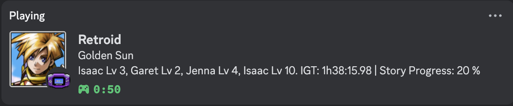

# RetroAchievements Discord Presence: Improved

*Example of Discord status automatically updating based on currently playing title.*


## Features:

- The game icon is displayed on the Discord's RP.
- The console currently being played is also displayed.
- Hovering over the game icon displays the user's overall achievements status about the current game. _(e.g "31 of 138 achieved | 22 %")_
- Displays the user's story progress percentage at the last part of the rich presence message about the current game. _(e.g "...some rich presence message | Story Progress: 48 %")_  
- A first button that redirects to the user's RA profile. _(Don't worry, I made an option to turn this off)_
- If the username display is turned off, the first button will have the link to the RetroAchievements website instead.
- A second button that redirects to the current game info inside the RetroAchievements website. 
- Discord's Rich Presence will get cleared after you stopped playing for 5 minutes (default). _(You can modify this duration inside the `config.ini` file)_
- Optimized game title.
- Optimized game status.
<hr>

## Prerequisites
- In order for this script to work, your emulator must be logged into RetroAchievements. RetroAchievements integration is supported in most mainstream emulators, but support may vary.
- You must obtain your RetroAchievements Web API Key in order for this script to authenticate to RA APIs. You can obtain your API key in your [RetroAchievement settings](https://retroachievements.org/settings). Credentials are stored on your local device.
- It is optional, but recommended that you provide your own Discord Client ID. This requires creating a [Discord Application](https://discord.com/developers/applications) and obtaining the Client ID from the "OAuth2" tab. The name of your Application will be refelected in your Discord status. By default, a Discord Application shared between users of this script is used.

## Instructions - Windows (Running it as an Exe file)
_In this way, you **don't need to install** Python and its packages._
1. Run the `Discord RA Rich Presence.exe` file.
2. A `config.ini` file will be generated and your RA credentials will be put inside of it.
3. Modify the `config.ini` file if you need to adjust some default settings. _(Like the timeout limit, refresh rate, or even your entered credentials)_
_Note: Running it silently/in the background isn't allowed with the `exe` file. You need to follow the instructions below to implement it._
<hr>

## Instructions - Windows/Mac/Linux (Running it as a Python file)
The following instructions assume Windows OS, but may be translated to similar commands for Mac/Linux.

1. Install Python. _(It works currently at version 3.13.1)_
2. In your command line, ensure that python is installed correctly by entering this command: `py --version` (Windows) `python3 --version` (Mac).
3. Run the command, `py -m pip install -r requirements.txt`. Make sure that you're running this command in this directory.
4. Open Discord App. (_NOTE: Discord App should always be opened first before running the `run.bat` file._)
5. Go to Discord > User Settings > Activity Privacy. Toggle on `Share your detected activity with others.`
6. Run the `run.bat` file (Windows) or run the script directly via Python (Mac/Linux), enter your credentials, `username` and `api key` from RetroAchievements.

Note: You may alternatively store your credentials via environment variables `RETROACHIEVEMENTS_USERNAME`, `RETROACHIEVEMENTS_API_KEY`, and `DISCORD_CLIENT_ID`. If set, they will be used by default.

After running the script a `config.ini` file will be created in the same directory. The credentials that you've submitted are stored in this config file.

## If you want to run the script in the background:
### Windows
1. Run the `batRunner.vbs` file instead of the `run.bat`. _(You can only do this once you've configured your credentials and your rich presence works already.)_ Otherwise, run your `run.bat` file. 
2. Since running the `batRunner.vbs` file makes the process not visible on the taskbar, you need to run the `batStopper.bat` to stop the rich presence from working. _(Otherwise, the other way is to stop `Python` from running on your task manager)_
3. It is also possible to make the `batRunner.vbs` file to run as startup app.<br>
   Make a shortcut of the file > Windows + R > Type `shell:startup`, then press Enter > Place the shortcut in this directory.<br><br>
If you want to keep the rich presence running, you can just edit the `config.ini` file and modify the `keepRunning` value. By default, it is set to `False`. Turn this to `True` if you want to keep it running without idling.

### Mac/Linux
1. Start Discord. If Discord is not officially supported on your OS, you may need an alternative client such as [LegCord](https://legcord.app/), for example. Official clients are recommended, use alternative clients at your own risk.
2. Ensure you have Python installed correctly via the [instructions above](#instructions---windowsmaclinux-running-it-as-a-python-file).
2. Run the following command in your terminal: `nohup python RARPC.py > rarpc-logs.log 2>&1 &`. This command will run the script in the background until the device is shutdown. Logs are redirected to `rarpc-logs.log`.

Note: dylanb124 is working on a solution to run this in the background after device shutdown/reboot, such as via systemd. Currently, there are issues accessing the Discord RPC when the service is run via systemd.

## Instructions - Docker

### Prerequisites
- Ensure you have Docker and Docker Compose installed on your system.
- Ensure your `.zshrc` file exports the necessary environment variables:
    ```sh
    export RETROACHIEVEMENTS_USERNAME=your_username
    export RETROACHIEVEMENTS_API_KEY=your_api_key
    export DISCORD_CLIENT_ID=your_discord_client_id
    ```

### Steps
1. Clone the repository:
    ```sh
    git clone https://github.com/your-repo/RetroAchievements-Discord-RPC-Improved.git
    cd RetroAchievements-Discord-RPC-Improved
    ```
2. Run the `.env.docker` script to generate the `.env` file:
    ```sh
    sh .env.docker
    ```
3. Build the Docker image:
    ```sh
    docker-compose build
    ```
4. Run the Docker container:
    ```sh
    docker-compose up -d
    ```

This setup will ensure that the script runs inside a Docker container and automatically restarts if it stops. The environment variables are passed to the container from the `.env` file generated by the `.env.docker` script.

## FAQ
### How to turn off username display?
1. If ever you don't want your username to have a redirection button on your Discord RP, just edit the `config.ini` file and modify the value inside the `displayUsername` to `False`. By default, this is `True`. _Notice the capital letters in the True and False as wrong cases may result to an error._
2. Save the changes you made, close the `run.bat` file, and open it again to reflect changes.
3. If you're using the `exe` file, just refer to step 2 and do the same thing. 

All the configurations inside the `config.ini` file can be modified based on your preferences. Just make sure to follow the proper syntax to avoid errors. 

## Things to keep in mind:
- Always open the Discord App first before running the script or the exe file.